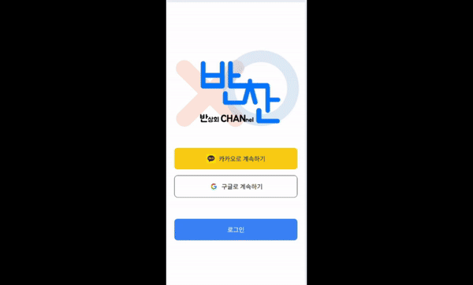
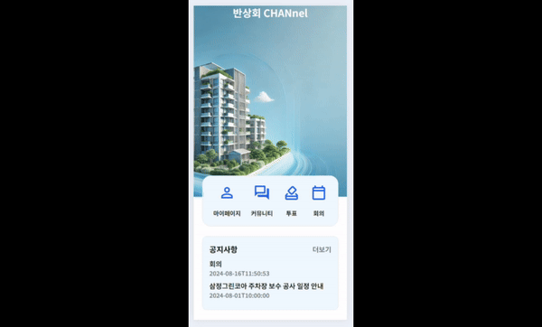
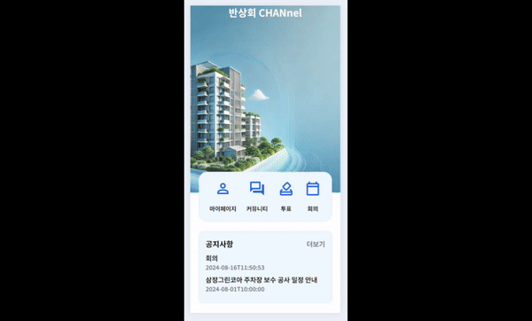
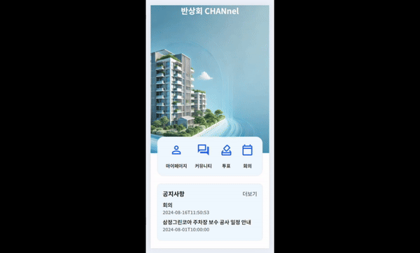
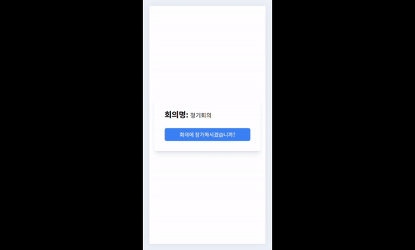

## Choose between 반대 or 찬성!!, 반찬(Banchan)📝

## _"주민 여러분께 알립니다. 오후 6시 201동 105호에서 반상회가 있을 예정이오니 늦지않게 참가 바랍니다."_

## 목차

1. [기획 의도 및 기대 효과](#1-기획-의도-및-기대-효과)
2. [주요 기능](#3-주요-기능)
3. [시스템 아키텍처](#4-시스템-아키텍처)
4. [포팅메뉴얼](#4-포팅메뉴얼)
5. [팀원 소개](#5-팀원-소개)

## 1. 기획 의도 및 기대 효과

지역 주민들이 직접 모여 의견을 나누고, 중요한 사안을 논의하는 "전통적인 반상회"는 주민들의 결속력을 강화하는 중요한 역할을 해왔으며 주민들의 목소리를 빠른 시일내에 반영하였습니다. 하지만 현재 바쁜 일상과 시간적 제약, 그리고 사회적 분위기로 인해 참석을 꺼려 하는 경우가 많습니다. 이에 따라, 온라인을 통해 누구나 쉽게 참여할 수 있는 새로운 형태의 익명 반상회 플랫폼 "반찬"을 기획하게 되었습니다.

"반찬"은 다양한 기술을 통해 물리적 제약을 넘어서는 소통의 장을 마련하고자 하며 주민들은 언제 어디서나 손쉽게 참여할 수 있으며, 다양한 의견을 실시간으로 나누고 공동의 결정을 내릴 수 있습니다. 특히, 온라인 주민투표 기능을 통해 지역 사회의 중요한 이슈에 대해 모든 주민이 평등하게 의견을 제시하고, 온라인 화상 주민회의를 통해 직접 대면하지 않더라도 서로의 생각을 나눌 수 있는 기회를 제공합니다.

"반찬"은 주민 간의 소통을 강화하여 더 나은 공동체를 만들기 위한 도구로서 기획되었습니다. 궁극적으로는 지역 사회의 모든 구성원이 자신의 목소리를 낼 수 있는 평등한 플랫폼을 제공하여, 보다 협력적이고 민주적인 지역 사회를 실현하고자 합니다.

## 2. 주요 기능
***3-1. 주요 기능 (관리자 Web)***

### 소셜 로그인 기능

### 입주민 승인

### 투표 기능

### 화상회의 기능

### 회의 요약본 기능

### 커뮤니티

***3-2. 주요 기능 (사용자 Moblile)***

### 소셜 로그인 기능

### 마이페이지

### 커뮤니티 (공지사항, 건의사항)

### 투표 및 결과보기

### 회의일정 및 요약본 공지 확인

### 회의 입장

## 3. 시스템 아키텍처

## 4. 포팅메뉴얼

### [포팅메뉴얼](https://github.com/wodyddldl333/banchan/blob/master/exec/%ED%8F%AC%ED%8C%85%EB%A7%A4%EB%89%B4%EC%96%BC.md) | [산출물](https://cotton-hornet-992.notion.site/120de0d40ebe80edb198cc8d0924552d?pvs=4)

## 5. 팀원 소개

| **[최동호](https://carpal-butterfly-bd7.notion.site/11-_-1-_E105_-_-_-f7e17ad039c44fcd9824176ec62b8f68?pvs=4)** | **[최재용](https://github.com/wodyddldl333)** | **[김하휼](https://github.com/busangangster)** | **[윤동환](https://deep-earth-a1c.notion.site/d2d299d3d00e4746ab7787fa0609a15a)** | **[정진우](https://polyester-midnight-1d2.notion.site/676f36ce758f48a998628825ef11ccea?pvs=4)** | **[김동건](https://fluffy-hippodraco-222.notion.site/201-105-2e4535a37b2b4672951a6e86f655d62b)** |
| :-------------------------------------------------------------------------------------------------------------: | :----------------------------------------------------------------------------------------------: | :---------------------------------------------------------------------------------------------------: | :-------------------------------------------------------------------------------: | :---------------------------------------------------------------------------------------------: | :----------------------------------------------------------------------------------------------: |
|                                                                             |                                                              |                                                                   |                                               |                                                             |                                                              |
|                                                     Backend                                                     |                                             Backend                                              |                                               Frontend                                                |                                     Frontend                                      |                                            Frontend                                             |                                              Infra                                               |

**Backend**

- 최동호 : 팀장 / 회원 및 인증 관련(OAuth, JWT) 유저, 관리자API / 패스키 구현 / UCC 제작 / 발표
- 최재용 : ERD 설계 및 DB 구축 / 공지사항, 건의사항, 투표 관련 API / WebRTC 서버 연동 및 화상회의 관련 API / STT와 AI를 활용한 회의 요약 서비스 구현 / 서버 에러 수정

**Frontend**

- 김하휼 : 웹/앱 전체적인 UI/UX 구현 / 화상 회의 관리 API 연동 / WebRTC 기반 환경 세팅 및 STT 데이터, 실시간 통신 처리
- 윤동환 : 프로젝트 기획 / 목업(피그마) 제작 / 시스템 아키텍쳐 등 산출물 제작 /유저 관리 및 인증(JWT, Oauth) 관련 api 연동 / 발표 자료 제작
- 정진우 : 와이어 프레임 제작/ 공지사항, 건의사항, 투표 관련 페이지 제작/ SMS 전송 시스템 구현 / 버전관리 시스템(git) 총괄 관리

**Infra**

- 김동건 : 개발환경 구축(프론트엔드&백엔드 도커 설정) / 배포환경 구축(리버스프록시 및 openvidu서버) / CI/CD자동배포-젠킨스 / 수동배포-쉘코드 / 포팅매뉴얼 및 기타 산출물 관리
