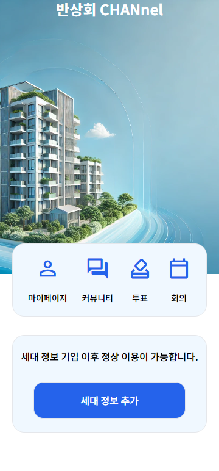

## Choose between 반대 or 찬성!!, 반찬(Banchan)📝

## *"주민 여러분께 알립니다. 오후 7시 201동 105호에서 반상회가 있을 예정이오니 늦지않게 참가 바랍니다."*

## 목차
1. [기획 의도 및 기대 효과](#기획 의도 및 기대 효과)
2. [개발 환경](#개발-환경)
3. [서비스 화면](#서비스-화면)
4. [주요 기능](#주요-기능)
5. [기술 소개](#기술-소개)
6. [설계 문서](#설계-문서)
7. [팀원 소개](#팀원-소개)

## 1. 기획 의도 및 기대 효과
지역 주민들이 직접 모여 의견을 나누고, 중요한 사안을 논의하는 "전통적인 반상회"는 주민들의 결속력을 강화하는 중요한 역할을 해왔으며 주민들의 목소리를 빠른 시일내에 반영하였습니다. 하지만 현재 바쁜 일상과 시간적 제약, 그리고 사회적 분위기로 인해 참석을 꺼려 하는 경우가 많습니다. 이에 따라, 온라인을 통해 누구나 쉽게 참여할 수 있는 새로운 형태의 반상회 플랫폼 "반찬"을 기획하게 되었습니다.

"반찬"은 다양한 기술을 통해 물리적 제약을 넘어서는 소통의 장을 마련하고자 하며 주민들은 언제 어디서나 손쉽게 참여할 수 있으며, 다양한 의견을 실시간으로 나누고 공동의 결정을 내릴 수 있습니다. 특히, 온라인 주민투표 기능을 통해 지역 사회의 중요한 이슈에 대해 모든 주민이 평등하게 의견을 제시하고, 온라인 화상 주민회의를 통해 직접 대면하지 않더라도 서로의 생각을 나눌 수 있는 기회를 제공합니다.

"반찬"은 주민 간의 소통을 강화하여 더 나은 공동체를 만들기 위한 도구로서 기획되었습니다. 궁극적으로는 지역 사회의 모든 구성원이 자신의 목소리를 낼 수 있는 평등한 플랫폼을 제공하여, 보다 협력적이고 민주적인 지역 사회를 실현하고자 합니다.

## 2. 개발 환경
### Frontend

| Typescript | 5.2.2 |
| React | 18.3.1 |
| NodeJs | 20.16.0 |

### Backend

| Java | 17 |
| Spring Boot | 3.3.2 |
| MySql | 8.0 |
| Redis | 7.4.0 |

### Infra

### CI/CD

| Docker | 27.1.1 |
| Docker Compose | 2.29.1 |
| Nginx | 1.27.0 |

| Jenkins | 2.462.1 |
