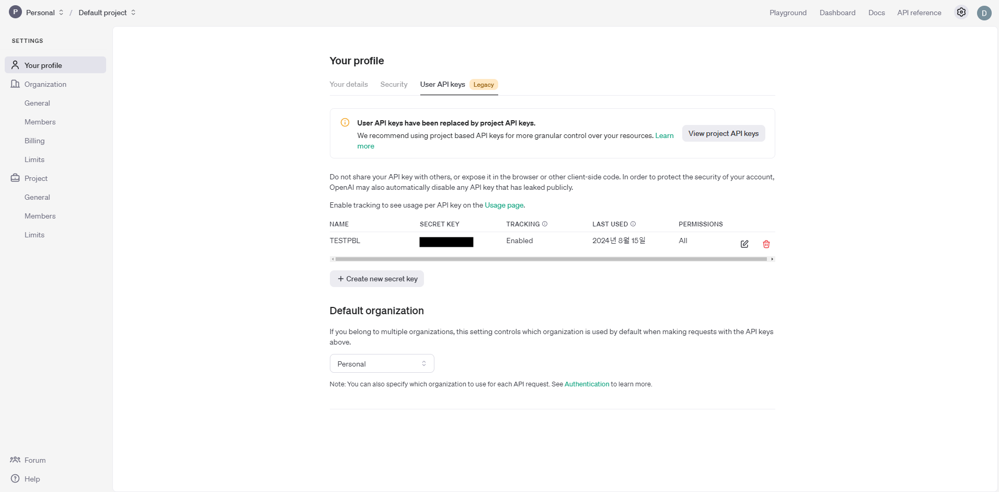

## ChatGPT - gpt-4o-mini

### ChatGPT

### 사용 방법
OPENAI에서 GPT API 사용 신청 및 키 발급
스프링 부트에 연동 시 프로퍼티 파일에 gpt 관련 변수 지정

    chatgpt:
    api-key: ${GPT_APIKEY}
    model: ${GPT_MODEL}
    max-token: 8196
    temperature: 0.0
    top-p: 1.0
    media-type: application/json; charset=UTF-8
    url: https://api.openai.com/v1/chat/completions

이후 @Configuration을 통해 자바 코드를 통해 스프링 컨테이너에 설정 파일로 관리

    @Configuration
    @ConfigurationProperties(prefix = "chatgpt")
    @Getter
    @Setter
    public class ChatGptConfig {
        private final String AUTHORIZATION = "Authorization";
        private final String BEARER = "Bearer ";
        private String apiKey;
        private String model;
        private Integer maxToken;
        private Double temperature;
        private Double topP;
        private String mediaType;
        private String url;
    }
이후 관련 DTO(Choice, Request, Response 등)을 생성 후 API 호출을 통해 response 받아서 서버에서 활용

**주의 사항 : 보안상 API 키는 환경변수로 설정하여 별도 관리**