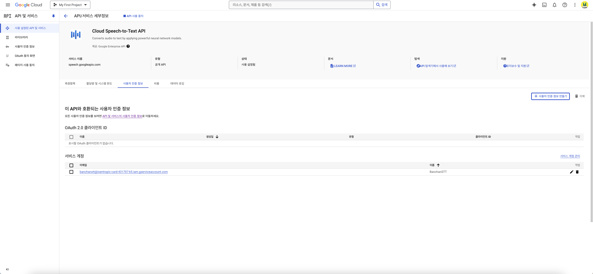

## Google STT(Speech-to-Text) API

### STT

**서비스 이름: Google Cloud Speech-to-Text API**

**사용 목적 : 음성을 텍스트로 변환하여 사용자 입력을 처리**

### 사용 방법
- Google Cloud Platform에서 계정 생성 후 프로젝트 생성.
- Speech-to-Text API를 해당 프로젝트에 활성화
- 서비스 계정을 생성하여 API 키 발급(json)
- 이후 스프링 부트 프로퍼티에 API 키 경로를 설정하거나 도커 환경변수를 통해 키 경로를 설정하여 사용

    @Configuration
    public class GoogleCloudConfig {

        @Bean
        public SpeechClient speechClient() throws IOException {

            GoogleCredentials credentials = GoogleCredentials.getApplicationDefault();

            SpeechSettings speechSettings = SpeechSettings.newBuilder()
                    .setCredentialsProvider(() -> credentials)
                    .build();

            return SpeechClient.create(speechSettings);
        }
    }

**주의 사항 : 보안상 API 키는 환경변수로 설정하여 별도 관리**