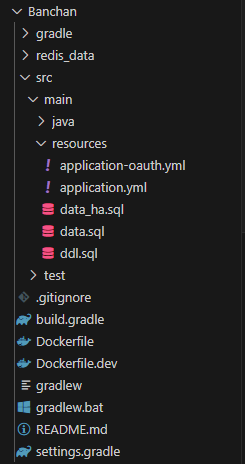
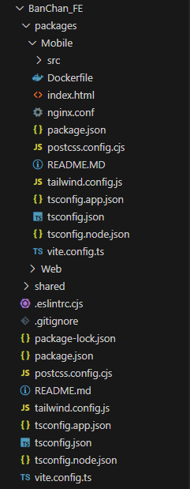

# 포팅 메뉴얼

## 1. 사용 도구

---

- 이슈 관리: **Jira**
- 형상 관리: **GitLab**
- 커뮤니케이션: **Notion, MatterMost**
- 디자인: **Figma**
- CI/CD:  **Jenkins**

## 2. 개발 도구

---

### Frontend

### Backend

- **Visual Studio Code 1.90.2**

- **Intellij 2024.1.4 (Ultimate Edition)**

## 3. 폴더 구조

---

- 전체 폴더 구조
    
    
    

- Backend
    
    
    

- Frontend-Web
    
    
    

- Frontend-Mobile
    
    
    

- Nginx(Reverse-proxy)
    
    
    

- Docker-compose
    
    
    
- Shellcode
    
    
    

## 4. 개발 환경 : Version

---

### Frontend
| Name | Version |
| --- | --- |
| Typescript | 5.2.2 |
| React | 18.3.1 |
| NodeJs | 20.16.0 |

### Backend
| Name | Version |
| --- | --- |
| Java | 17 |
| Spring Boot | 3.3.2 |
| MySql | 8.0 |
| Redis | 7.4.0 |

### Infra
| Name | Version |
| --- | --- |
| Docker | 27.1.1 |
| Docker Compose | 2.29.1 |
| Nginx | 1.27.0 |

### CI/CD
| Name | Version |
| --- | --- |
| Jenkins | 2.462.1 |

## 5. 환경 변수

---

### Backend

```
spring:
  application:
    name: Banchan # 애플리케이션 이름 설정
  
  http:
    encoding:
      charset: UTF-8
      enabled: true
      force: true

  datasource:
    driver-class-name: com.mysql.cj.jdbc.Driver # MySQL JDBC 드라이버 클래스 이름
    url: jdbc:mysql://${MYSQL_HOST}:${MYSQL_PORT}/${MYSQL_DATABASE}?useUnicode=true&characterEncoding=utf8&characterSetResults=utf8&serverTimezone=UTC # MySQL 데이터베이스 URL
    username: ${MYSQL_ROOT_USER} # MySQL 데이터베이스 사용자 이름
    password: ${MYSQL_ROOT_PASSWORD} # MySQL 데이터베이스 비밀번호

  jpa:
    properties:
      hibernate:
        show_sql: true # SQL 쿼리를 콘솔에 출력
        format_sql: true # SQL 쿼리를 읽기 쉽게 포맷팅
    hibernate:
      ddl-auto: ${SPRING_JPA_HIBERNATE_DDL_AUTO} # 애플리케이션 시작 시 데이터베이스 스키마 자동 생성
    database-platform: org.hibernate.dialect.MySQLDialect # MySQL Dialect 설정

  profiles:
    active: oauth # 활성화할 Spring 프로파일 설정

jwt:
  secret: ${JWT_SECRET} # JWT 토큰 서명을 위한 비밀 키
  expiration: ${JWT_EXPIRATION} # JWT 토큰 만료 시간 (밀리초 단위)

spring.data.redis:
  host: ${REDIS_HOST} # Redis 서버 호스트
  port: ${REDIS_PORT} # Redis 서버 포트
  password: ${REDIS_PASSWORD} # Redis 서버 비밀번호

server:
  port: ${SERVER_PORT} # 애플리케이션 서버 포트

logging:
  level:
    root: INFO # 루트 로거 레벨 설정
    org.springframework.security: INFO # Spring Security 로거 레벨 설정
    org.springframework.web: INFO # Spring Web 로거 레벨 설정
    org.hibernate: INFO # Hibernate 로거 레벨 설정

# Swagger Configuration
springdoc:
  api-docs:
    enabled: true # API 문서 생성 활성화
  swagger-ui:
    enabled: true # Swagger UI 활성화
    path: /swagger-ui.html # Swagger UI 접근 경로 설정

openvidu:
  url: ${OPENVIDU_PUBLICURL}
  secret: ${OPENVIDU_SECRET}

file:
  upload-dir: /app/uploads
  record:
    path: /opt/openvidu/recordings/

chatgpt:
  api-key: ${GPT_APIKEY}
  model: ${GPT_MODEL}
  max-token: 8196
  temperature: 0.0
  top-p: 1.0
  media-type: application/json; charset=UTF-8
  url: https://api.openai.com/v1/chat/completions

```

### Frontend

```
VITE_API_URL=https://i11e105.p.ssafy.io
VITE_KAKAO_REDIRECT_URI=https://i11e105.p.ssafy.io/login/oauth2/code/kakao
VITE_KAKAO_CLIENT_ID = {secret}

VITE_M_API_URL=https://i11e105.p.ssafy.io
VITE_M_KAKAO_REDIRECT_URI=https://i11e105.p.ssafy.io/m/login/oauth2/code/kakao

VITE_MESSAGE_API_SECRET_KEY= {secret}
VITE_MESSAGE_API_KEY = {secret}
```

### Openvidu

```
DOMAIN_OR_PUBLIC_IP=i11e105.p.ssafy.io

OPENVIDU_SECRET={secret}

CERTIFICATE_TYPE=letsencrypt

LETSENCRYPT_EMAIL={secret}

HTTPS_PORT=8443

OPENVIDU_RECORDING=true
OPENVIDU_RECORDING_DEBUG=false
OPENVIDU_RECORDING_PATH=/opt/openvidu/recordings
OPENVIDU_RECORDING_CUSTOM_LAYOUT=/opt/openvidu/custom-layout
OPENVIDU_RECORDING_PUBLIC_ACCESS=false
OPENVIDU_RECORDING_NOTIFICATION=none
OPENVIDU_RECORDING_AUTOSTOP_TIMEOUT=120

OPENVIDU_STREAMS_VIDEO_MAX_RECV_BANDWIDTH=1000
OPENVIDU_STREAMS_VIDEO_MIN_RECV_BANDWIDTH=300
OPENVIDU_STREAMS_VIDEO_MAX_SEND_BANDWIDTH=1000
OPENVIDU_STREAMS_VIDEO_MIN_SEND_BANDWIDTH=300
OPENVIDU_STREAMS_ALLOW_TRANSCODING=true

OPENVIDU_WEBHOOK=false
OPENVIDU_WEBHOOK_EVENTS=[sessionCreated,sessionDestroyed,participantJoined,participantLeft,webrtcConnectionCreated,webrtcConnectionDestroyed,recordingStatusChanged,filterEventDispatched,mediaNodeStatusChanged,nodeCrashed,nodeRecovered,broadcastStarted,broadcastStopped]

OPENVIDU_SESSIONS_GARBAGE_INTERVAL=900
OPENVIDU_SESSIONS_GARBAGE_THRESHOLD=3600

OPENVIDU_CDR=false
OPENVIDU_CDR_PATH=/opt/openvidu/cdr
```

## 6. CI/CD

---

### AWS

- 포트 번호
    
    | Proxy | Port |
    | --- | --- |
    | Reverse_Proxy(Nginx) | 80, 443 |
    | Openvidu-Nginx | 8443 |

### Docker

```
sudo apt-get update -y
sudo apt-get install -y apt-transport-https ca-certificates curl software-properties-common

curl -fsSL https://download.docker.com/linux/ubuntu/gpg | sudo apt-key add -

sudo add-apt-repository \
   "deb [arch=amd64] https://download.docker.com/linux/ubuntu \
   $(lsb_release -cs) \
   stable"

sudo apt-get update -y

sudo apt-get install -y docker-ce

sudo systemctl status docker

sudo usermod -aG docker ${USER}
```

### Docker-Compose

```
# Docker Compose를 다운로드합니다. 여기서는 최신 버전을 사용합니다.
# 버전을 지정하려면, `$(uname -s)-$(uname -m)` 앞에 원하는 버전을 추가합니다. 예: `1.29.2`
sudo curl -L "https://github.com/docker/compose/releases/latest/download/docker-compose-$(uname -s)-$(uname -m)" -o /usr/local/bin/docker-compose

# Docker Compose에 실행 권한을 부여합니다.
sudo chmod +x /usr/local/bin/docker-compose

# Docker Compose 버전을 확인하여, 설치가 제대로 되었는지 확인합니다.
docker-compose --version
```

### Jenkins

- Dockerfile
    
    ```
    # Dockerfile
    # 베이스 이미지로 최신 장기 지원 버전(LTS) Jenkins 이미지를 사용합니다.
    FROM jenkins/jenkins:lts
    
    # root 사용자로 명령어를 실행할 수 있도록 전환합니다.
    USER root
    
    # Docker를 설치하기 위한 패키지 설치
    RUN apt-get update && \  # 패키지 목록을 업데이트합니다.
        apt-get install -y \  # 필수 패키지를 설치합니다.
        sudo \  # sudo 패키지를 설치하여 Jenkins 사용자가 관리자 권한 명령을 실행할 수 있도록 합니다.
        apt-transport-https \  # HTTPS를 통해 패키지를 다운로드할 수 있는 기능을 추가합니다.
        ca-certificates \  # SSL 인증서를 처리하는 패키지입니다.
        curl \  # URL에서 데이터를 가져오는 도구입니다. Docker 설치 시 GPG 키를 추가하는 데 사용됩니다.
        gnupg-agent \  # GPG 키 관리를 위한 에이전트입니다.
        software-properties-common && \  # 소프트웨어 저장소 관리 도구입니다.
        curl -fsSL https://download.docker.com/linux/debian/gpg | apt-key add - && \  # Docker 공식 GPG 키를 추가합니다.
        add-apt-repository \  # Docker 저장소를 추가합니다.
        "deb [arch=amd64] https://download.docker.com/linux/debian $(lsb_release -cs) stable" && \  # Debian 기반 Docker 저장소를 추가합니다.
        apt-get update && \  # 패키지 목록을 다시 업데이트합니다. 이번에는 Docker 패키지가 포함됩니다.
        apt-get install -y docker-ce docker-ce-cli containerd.io git && \  # Docker 엔진, CLI, 컨테이너 런타임, Git을 설치합니다.
        apt-get clean  # 설치 후 패키지 캐시를 정리하여 이미지 크기를 줄입니다.
    
    # Docker Compose 설치
    RUN curl -L "https://github.com/docker/compose/releases/download/1.29.2/docker-compose-$(uname -s)-$(uname -m)" -o /usr/local/bin/docker-compose && \  # Docker Compose를 GitHub에서 다운로드합니다.
        chmod +x /usr/local/bin/docker-compose  # Docker Compose 실행 파일에 실행 권한을 부여합니다.
    
    # jenkins 사용자를 sudoers 파일에 추가하여 비밀번호 입력 없이 sudo 명령을 실행할 수 있도록 설정합니다.
    RUN echo "jenkins ALL=(ALL) NOPASSWD: ALL" >> /etc/sudoers
    
    # jenkins 사용자로 다시 전환하여 Jenkins의 기본 동작을 유지합니다.
    USER jenkins
    ```
    
- docker-compose
    
    ```java
    services:
      jenkins:
        container_name: jenkins  # 생성되는 컨테이너의 이름을 'jenkins'로 지정합니다.
        build:
          dockerfile: Dockerfile  # 현재 디렉토리에서 'Dockerfile'을 사용하여 이미지를 빌드합니다.
        expose:
          - "8080"  # 내부에서 포트 8080을 노출합니다. (Jenkins UI에 사용됨)
          - "50000"  # 내부에서 포트 50000을 노출합니다. (Jenkins 에이전트 연결에 사용됨)
        environment:
          JENKINS_OPTS: --prefix=/jenkins  # Jenkins의 URL 접두사를 '/jenkins'로 설정합니다.
          JAVA_OPTS: "-Djenkins.install.runSetupWizard=false"  # Jenkins 초기 설정 마법사를 비활성화합니다.
        volumes:
          - ../jenkins_home:/var/jenkins_home  # 호스트의 'jenkins_home' 디렉토리를 컨테이너의 '/var/jenkins_home' 디렉토리와 바인딩하여 Jenkins 데이터를 영구 저장합니다.
          - /var/run/docker.sock:/var/run/docker.sock  # Docker 컨테이너에서 Docker를 실행할 수 있도록 Docker 소켓을 바인딩합니다.
        networks:
          - mynetwork  # 컨테이너가 'mynetwork' 네트워크에 연결되도록 설정합니다.
    
    networks:
      mynetwork:
        external: true  # 'mynetwork' 네트워크를 외부에서 관리하는 네트워크로 정의합니다. 이 네트워크는 Docker Compose 외부에서 이미 생성된 상태여야 합니다.
    ```
    
- Pipeline
    
    ```java
    pipeline {
        agent any
    
        environment {
            GIT_CREDENTIAL_ID = 'pwd-gitlab-ssafy'
        }
    
        stages {
            stage('Checkout') {
                steps {
                    script {
                        git url: 'https://lab.ssafy.com/s11-webmobile1-sub2/S11P12E105.git', branch: 'production', credentialsId: GIT_CREDENTIAL_ID
                    }
                    
                }
            }
            stage('Set Env, Build and Deploy Backend') {
                when {
                    changeset "Banchan/**"
                }
                steps {
                    script {
                        sh '''
                        sudo chown -R jenkins:jenkins ./docker-compose
                        sudo chmod -R u+w ./docker-compose
                        '''
                        
                        writeFile file: 'docker-compose/.env', text: """
                        # Back ENV
                        """
                        
                        writeFile file: 'docker-compose/credentials.json', text: """
                        {
                            STT API KEY
                        }"""
                        
                        sh '''
                        sudo docker stop banchan_back1 || true
                        sudo docker stop banchan_back2 || true
                        sudo docker stop mysql || true
                        sudo docker stop redis || true
    
                        sudo docker rm banchan_back1 || true
                        sudo docker rm banchan_back2 || true
                        sudo docker rm mysql || true
                        sudo docker rm redis || true
    
                        sudo docker volume prune -a -f
                        sudo docker builder prune -a -f
                        sudo docker image prune -a -f
                        
                        sudo docker volume rm docker-compose_mysql_data || true
                        sudo docker volume rm docker-compose_redis_data || true
                        
                        sudo docker-compose -f docker-compose/docker-compose-back.yml up -d
                        '''
                    }
                }
            }
            stage('Set Env, Build and DeployFrontend Web') {
                when {
                    changeset "BanChan_FE/packages/Web/**"
                }
                steps {
                    script {
                        sh '''
                        sudo chown -R jenkins:jenkins BanChan_FE/packages/Web
                        sudo chmod -R u+w BanChan_FE/packages/Web
                        '''
                        
                        writeFile file: 'BanChan_FE/packages/Web/.env', text: """
                        #Front Web ENV
                        """
                        
                        sh '''
                        sudo docker stop banchan_front_web || true
    
                        sudo docker rm banchan_front_web || true
                        
                        sudo docker volume prune -a -f
                        
                        sudo docker builder prune -a -f
                        
                        sudo docker image prune -a -f
                        
                        sudo docker-compose -f docker-compose/docker-compose-front-web.yml up -d
                        '''
                    }
                }
            }
            stage('Set Env, Build and DeployFrontend Mobile') {
                when {
                    changeset "BanChan_FE/packages/Mobile/**"
                }
                steps {
                    script {
                        sh '''
                        sudo chown -R jenkins:jenkins BanChan_FE/packages/Mobile
                        sudo chmod -R u+w BanChan_FE/packages/Mobile
                        '''
                        
                        writeFile file: 'BanChan_FE/packages/Mobile/.env', text: """
                        #Front Mobile ENV
                        """
                        
                        sh '''
                        sudo docker stop banchan_front_mobile || true
    
                        sudo docker rm banchan_front_mobile || true
                        
                        sudo docker volume prune -a -f
                        
                        sudo docker builder prune -a -f
                        
                        sudo docker image prune -a -f
                        
                        sudo docker-compose -f docker-compose/docker-compose-front-mobile.yml up -d
                        '''
                    }
                }
            }
            
        }
        post {
            always {
                cleanWs()
            }
        }
    }
    
    ```
    

## 7. 배포 단계

---

### ReverseProxy

- Dockerfile
    
    ```
    # nginx/Dockerfile
    FROM nginx:alpine
    COPY ./nginx.conf /etc/nginx/nginx.conf
    COPY ./ssl /etc/nginx/ssl
    ```
    
- docker-compose
    
    ```java
    # docker-compose-resource.yml
    services:
      nginx:
        container_name: reverse
        build:
          context: ../nginx
          dockerfile: Dockerfile
        ports:
          - "80:80"
          - "443:443"
        networks:
          - mynetwork
    
    networks:
      mynetwork:
        external: true
    
    ```
    
- nginx.config
    
    ```java
    events {}
    
    http {
        upstream backend {
            ip_hash;
            server banchan_back1:8080;
            server banchan_back2:8080;
        }
        server {
            listen 80;
            server_name i11e105.p.ssafy.io;
    
            location / {
                return 301 https://$host$request_uri;
            }
        }
    
        server {
            listen 443 ssl;
            server_name i11e105.p.ssafy.io; # 여기에 서버의 도메인 또는 IP를 입력하세요
    
            # SSL Config
            ssl_certificate         /etc/nginx/ssl/fullchain.pem;
            ssl_certificate_key     /etc/nginx/ssl/privkey.pem;
            ssl_trusted_certificate /etc/nginx/ssl/fullchain.pem;
    
            ssl_session_cache shared:SSL:50m;
            ssl_session_timeout 5m;
            ssl_stapling on;
            ssl_stapling_verify on;
    
            ssl_protocols TLSv1.2 TLSv1.3;
            ssl_ciphers "ECDHE-ECDSA-AES128-GCM-SHA256:ECDHE-RSA-AES128-GCM-SHA256:ECDHE-ECDSA-AES256-GCM-SHA384:ECDHE-RSA-AES256-GCM-SHA384:ECDHE-ECDSA-CHACHA20-POLY1305:ECDHE-RSA-CHACHA20-POLY1305:DHE-RSA-AES128-GCM-SHA256:DHE-RSA-AES256-GCM-SHA384";
            ssl_prefer_server_ciphers off;
    
            add_header Strict-Transport-Security "max-age=63072000" always;
    
            location /swagger-ui {
                proxy_pass http://backend;
                proxy_set_header Host $host;
                proxy_set_header X-Real-IP $remote_addr;
                proxy_set_header X-Forwarded-For $proxy_add_x_forwarded_for;
                proxy_set_header X-Forwarded-Proto https;
                proxy_http_version 1.1;
                proxy_set_header Accept-Encoding "";  # 백엔드 서버에서 압축된 응답이 아닌 것을 보내도록 요청
                charset utf-8;  # 응답 인코딩을 UTF-8로 설정
            }
            
            location /v3/api-docs {
                proxy_pass http://backend;
                proxy_set_header Host $host;
                proxy_set_header X-Real-IP $remote_addr;
                proxy_set_header X-Forwarded-For $proxy_add_x_forwarded_for;
                proxy_set_header X-Forwarded-Proto https;
                proxy_http_version 1.1;
                proxy_set_header Accept-Encoding "";  # 백엔드 서버에서 압축된 응답이 아닌 것을 보내도록 요청
                charset utf-8;  # 응답 인코딩을 UTF-8로 설정
            }
    
            location /api {
                proxy_pass http://backend;
                proxy_set_header Host $host;
                proxy_set_header X-Real-IP $remote_addr;
                proxy_set_header X-Forwarded-For $proxy_add_x_forwarded_for;
                proxy_set_header X-Forwarded-Proto https;
                proxy_http_version 1.1;
                proxy_set_header Accept-Encoding "";  # 백엔드 서버에서 압축된 응답이 아닌 것을 보내도록 요청
                charset utf-8;  # 응답 인코딩을 UTF-8로 설정
            }
    
            location /oauth2 {
                proxy_pass http://backend;
                proxy_set_header Host $host;
                proxy_set_header X-Real-IP $remote_addr;
                proxy_set_header X-Forwarded-For $proxy_add_x_forwarded_for;
                proxy_set_header X-Forwarded-Proto https;
                proxy_http_version 1.1;
                proxy_set_header Accept-Encoding "";  # 백엔드 서버에서 압축된 응답이 아닌 것을 보내도록 요청
                charset utf-8;  # 응답 인코딩을 UTF-8로 설정
            }
    
            location /jenkins {
                proxy_pass http://jenkins:8080;
                proxy_set_header Host $host;
                proxy_set_header X-Real-IP $remote_addr;
                proxy_set_header X-Forwarded-For $proxy_add_x_forwarded_for;
                proxy_set_header X-Forwarded-Proto https;
                proxy_http_version 1.1;
            }
    
            location / {
                proxy_pass http://banchan_front_web;
                proxy_set_header Host $host;
                proxy_set_header X-Real-IP $remote_addr;
                proxy_set_header X-Forwarded-For $proxy_add_x_forwarded_for;
                proxy_set_header X-Forwarded-Proto https;
                proxy_http_version 1.1;
                # WebSocket 지원
                proxy_set_header Upgrade $http_upgrade;
                proxy_set_header Connection "upgrade";
            }
    
            location /m/ {
                proxy_pass http://banchan_front_mobile;
                proxy_set_header Host $host;
                proxy_set_header X-Real-IP $remote_addr;
                proxy_set_header X-Forwarded-For $proxy_add_x_forwarded_for;
                proxy_set_header X-Forwarded-Proto https;
                proxy_http_version 1.1;
                # WebSocket 지원
                proxy_set_header Upgrade $http_upgrade;
                proxy_set_header Connection "upgrade";
            }
        }
    }
    ```
    

### Frontend(Web)

- Dockerfile
    
    ```
    # Stage 1: Build the React app
    FROM node:20-alpine AS build  # Node.js의 경량 Alpine Linux 이미지를 사용하여 첫 번째 빌드 단계를 시작합니다.
    
    WORKDIR /app  # 작업 디렉토리를 /app으로 설정합니다. 모든 명령은 이 디렉토리 내에서 실행됩니다.
    
    COPY package.json ./  # package.json 파일을 컨테이너의 /app 디렉토리로 복사합니다.
    RUN npm install  # package.json에 정의된 종속성을 설치합니다.
    
    RUN npm install --save-dev ts-node  # ts-node를 개발 종속성으로 설치합니다. 이는 TypeScript 파일을 Node.js로 실행할 때 사용될 수 있습니다.
    
    RUN npm install @types/node --save-dev  # Node.js의 TypeScript 타입 정의 파일을 설치합니다.
    
    RUN npm install @types/crypto-js --save-dev  # crypto-js 라이브러리의 TypeScript 타입 정의 파일을 설치합니다.
    
    COPY . .  # 현재 디렉토리의 모든 파일을 컨테이너의 /app 디렉토리에 복사합니다.
    
    RUN npm run build  # React 애플리케이션을 빌드합니다. 이는 보통 src 디렉토리의 소스 파일을 /app/dist 디렉토리에 빌드된 파일로 출력합니다.
    
    # Stage 2: Serve the app with Nginx
    FROM nginx:alpine  # 경량 Nginx 이미지 기반으로 두 번째 배포 단계 시작
    
    COPY nginx.conf /etc/nginx/conf.d/default.conf  # 커스텀 Nginx 설정 파일을 컨테이너 내 Nginx의 기본 설정 파일 위치에 복사합니다.
    
    COPY --from=build /app/dist /etc/nginx/html  # 첫 번째 빌드 단계에서 생성된 빌드 결과물(/app/dist)을 Nginx의 웹 루트 디렉토리(/etc/nginx/html)로 복사합니다.
    
    # Copy custom Nginx configuration if needed
    # COPY nginx.conf /etc/nginx/nginx.conf  # 필요할 경우, 추가적인 Nginx 설정 파일을 복사합니다. 이 줄은 주석 처리되어 있으며, 필요 시 활성화할 수 있습니다.
    
    EXPOSE 80  # 컨테이너 외부에서 접근할 수 있도록 80번 포트를 노출합니다.
    
    CMD ["nginx", "-g", "daemon off;"]  # Nginx를 포그라운드 모드로 실행하여 컨테이너가 종료되지 않고 지속적으로 실행되도록 합니다.
    
    ```
    
- Docker Compose
    
    ```
    services:
      banchan_front_web:
        container_name: banchan_front_web
        build:
          context: ../BanChan_FE/packages/Web
          dockerfile: Dockerfile
        expose:
          - "80"
        networks:
          - mynetwork
    
    networks:
      mynetwork:
        external: true
    ```
    

### Frontend(Mobile)

- Dockerfile
    
    ```
    # Stage 1: Build the React app
    FROM node:20-alpine AS build
    
    WORKDIR /app
    
    COPY package.json ./
    RUN npm install
    
    RUN npm install --save-dev ts-node
    
    RUN npm install @types/node --save-dev
    
    RUN npm install @types/crypto-js --save-dev
    
    COPY . .
    
    RUN npm run build
    
    # Stage 2: Serve the app with Nginx
    FROM nginx:alpine
    
    COPY nginx.conf /etc/nginx/conf.d/default.conf
    COPY --from=build /app/dist /etc/nginx/html
    
    # Copy custom Nginx configuration if needed
    # COPY nginx.conf /etc/nginx/nginx.conf
    
    EXPOSE 80
    
    CMD ["nginx", "-g", "daemon off;"]
    ```
    
- Docker Compose
    
    ```
    services:
      banchan_front_mobile:
        container_name: banchan_front_mobile
        build:
          context: ../BanChan_FE/packages/Mobile
          dockerfile: Dockerfile
        expose:
          - "80"
        networks:
          - mynetwork
          
    networks:
      mynetwork:
        external: true
    ```
    
- vite.config.ts
    
    ```java
    import { defineConfig } from "vite";
    import react from "@vitejs/plugin-react";
    import tsconfigPaths from "vite-tsconfig-paths";
    import path from "path";
    
    export default defineConfig({
      plugins: [react(), tsconfigPaths()],
      resolve: {
        alias: {
          "@assets": path.resolve(__dirname, "./src/assets"),
        },
      },
      build: {
        outDir: "dist",
      },
      base: '/m',  // 모든 경로에 /m을 붙이도록 설정
    });
    ```
    

### Backend

- Dockerfile
    
    ```
    # 베이스 이미지 설정 (OpenJDK 17)
    FROM openjdk:17-jdk-slim
    
    # 빌드 타임 변수 설정
    ARG APP_HOME=/app
    ARG APP_JAR=Banchan-0.0.1-SNAPSHOT.jar
    ARG APP_TARGET=build/libs
    
    WORKDIR $APP_HOME
    
    # Gradle 설치 - 컨테이너 안에서 빌드하기 위해
    RUN apt-get update && apt-get install -y wget unzip dos2unix \
        && wget https://services.gradle.org/distributions/gradle-7.3.3-bin.zip \
        && unzip gradle-7.3.3-bin.zip -d /opt \
        && rm gradle-7.3.3-bin.zip \
        && ln -s /opt/gradle-7.3.3/bin/gradle /usr/bin/gradle
    
    # Gradle과 프로젝트 관련 파일들을 복사
    COPY build.gradle settings.gradle gradle /app/
    COPY gradlew /app/gradlew
    COPY gradlew.bat /app/gradlew.bat
    COPY gradle/wrapper /app/gradle/wrapper
    COPY src /app/src
    
    # gradlew에 실행 권한 추가 및 dos2unix 변환
    RUN chmod +x /app/gradlew && dos2unix /app/gradlew
    
    # Gradle을 사용하여 애플리케이션 빌드
    RUN ./gradlew build
    
    # 애플리케이션 실행 명령어 설정
    CMD ["java", "-jar", "build/libs/Banchan-0.0.1-SNAPSHOT.jar"]
    ```
    
- Docker Compose(with mysql, redis)
    
    ```
    x-environments: &default
      env_file: .env # 기본 환경 파일을 지정합니다.
    
    services:
      banchan_back1:
        container_name: banchan_back1
        build:
          context: ../Banchan/
          dockerfile: Dockerfile
        expose:
          - "8080"
        <<: *default
        environment:
          SPRING_JPA_HIBERNATE_DDL_AUTO: update
          GOOGLE_APPLICATION_CREDENTIALS: /app/config/credentials.json
        depends_on:
          mysql:
            condition: service_healthy
          redis:
            condition: service_healthy
        networks:
          - mynetwork
        volumes:
          - /home/ubuntu/201-105/S11P12E105/Banchan/uploads:/app/uploads
          - /opt/openvidu/recordings:/opt/openvidu/recordings
          - /home/ubuntu/201-105/S11P12E105/docker-compose/credentials.json:/app/config/credentials.json:ro
      banchan_back2:
        container_name: banchan_back2
        build:
          context: ../Banchan/
          dockerfile: Dockerfile
        expose:
          - "8080"
        <<: *default
        environment:
          SPRING_JPA_HIBERNATE_DDL_AUTO: update
          GOOGLE_APPLICATION_CREDENTIALS: /app/config/credentials.json
        depends_on:
          mysql:
            condition: service_healthy
          redis:
            condition: service_healthy
        networks:
          - mynetwork
        volumes:
          - /home/ubuntu/201-105/S11P12E105/Banchan/uploads:/app/uploads
          - /opt/openvidu/recordings:/opt/openvidu/recordings
          - /home/ubuntu/201-105/S11P12E105/docker-compose/credentials.json:/app/config/credentials.json:ro
    
      mysql:
        image: mysql:8.0
        container_name: mysql
        expose:
          - "3306"
        <<: *default
        command: # 명령어 실행
          - --character-set-server=utf8mb4
          - --collation-server=utf8mb4_unicode_ci
        volumes:
          - /home/ubuntu/201-105/S11P12E105/Banchan/mysql_data:/var/lib/mysql
        networks:
          - mynetwork
        healthcheck:
          test:
            [
              "CMD-SHELL",
              "mysqladmin ping -h localhost -u${MYSQL_ROOT_USER} -p${MYSQL_ROOT_PASSWORD}",
            ]
          interval: 10s
          timeout: 5s
          retries: 5
    
      redis:
        image: redis:latest
        command: redis-server /usr/local/etc/redis/redis.conf --requirepass banchan201105
        container_name: redis
        expose:
          - "6379"
        <<: *default
        volumes:
          - /home/ubuntu/201-105/S11P12E105/Banchan/redis_data:/data
          - /home/ubuntu/201-105/S11P12E105/Banchan/redis_data/redis.conf:/usr/local/etc/redis/redis.conf
        networks:
          - mynetwork
        healthcheck:
          test: ["CMD", "redis-cli", "ping"]
          interval: 10s
          timeout: 5s
          retries: 5
    
    volumes:
      mysql_data:
        driver: local
        driver_opts:
          type: none
          device: /home/ubuntu/201-105/S11P12E105/Banchan/mysql_data
          o: bind
      redis_data:
        driver: local
        driver_opts:
          type: none
          device: /home/ubuntu/201-105/S11P12E105/Banchan/redis_data
          o: bind
    
    networks:
      mynetwork:
        external: true
    
    ```
    

### Openvidu

- Docker Compose
    
    ```
    services:
    
        openvidu-server:
            image: openvidu/openvidu-server:2.28.0
            restart: on-failure
            network_mode: host
            entrypoint: ['/usr/local/bin/entrypoint.sh']
            volumes:
                - ./coturn:/run/secrets/coturn
                - /var/run/docker.sock:/var/run/docker.sock
                - ${OPENVIDU_RECORDING_PATH}:${OPENVIDU_RECORDING_PATH}
                - ${OPENVIDU_RECORDING_CUSTOM_LAYOUT}:${OPENVIDU_RECORDING_CUSTOM_LAYOUT}
                - ${OPENVIDU_CDR_PATH}:${OPENVIDU_CDR_PATH}
            env_file:
                - .env
            environment:
                - SERVER_SSL_ENABLED=false
                - SERVER_PORT=5443
                - KMS_URIS=["ws://localhost:8888/kurento"]
                - COTURN_IP=${COTURN_IP:-auto-ipv4}
                - COTURN_PORT=${COTURN_PORT:-3478}
            logging:
                options:
                    max-size: "${DOCKER_LOGS_MAX_SIZE:-100M}"
    
        kms:
            image: ${KMS_IMAGE:-kurento/kurento-media-server:7.0.1}
            restart: always
            network_mode: host
            ulimits:
              core: -1
            volumes:
                - /opt/openvidu/kms-crashes:/opt/openvidu/kms-crashes
                - ${OPENVIDU_RECORDING_PATH}:${OPENVIDU_RECORDING_PATH}
                - /opt/openvidu/kurento-logs:/opt/openvidu/kurento-logs
            environment:
                - KMS_MIN_PORT=40000
                - KMS_MAX_PORT=57000
                - GST_DEBUG=${KMS_DOCKER_ENV_GST_DEBUG:-}
                - KURENTO_LOG_FILE_SIZE=${KMS_DOCKER_ENV_KURENTO_LOG_FILE_SIZE:-100}
                - KURENTO_LOGS_PATH=/opt/openvidu/kurento-logs
            logging:
                options:
                    max-size: "${DOCKER_LOGS_MAX_SIZE:-100M}"
    
        coturn:
            image: openvidu/openvidu-coturn:2.28.0
            restart: on-failure
            ports:
                - "${COTURN_PORT:-3478}:${COTURN_PORT:-3478}/tcp"
                - "${COTURN_PORT:-3478}:${COTURN_PORT:-3478}/udp"
            env_file:
                - .env
            volumes:
                - ./coturn:/run/secrets/coturn
            command:
                - --log-file=stdout
                - --listening-port=${COTURN_PORT:-3478}
                - --fingerprint
                - --min-port=${COTURN_MIN_PORT:-57001}
                - --max-port=${COTURN_MAX_PORT:-65535}
                - --realm=openvidu
                - --verbose
                - --use-auth-secret
                - --static-auth-secret=$${COTURN_SHARED_SECRET_KEY}
            logging:
                options:
                    max-size: "${DOCKER_LOGS_MAX_SIZE:-100M}"
    
        nginx:
            image: openvidu/openvidu-proxy:2.28.0
            restart: always
            network_mode: host
            volumes:
                - ./certificates:/etc/letsencrypt
                - ./owncert:/owncert
                - ./custom-nginx-vhosts/default.conf:/etc/nginx/conf.d/default.conf
                - ./custom-nginx-locations:/custom-nginx-locations
                - ${OPENVIDU_RECORDING_CUSTOM_LAYOUT}:/opt/openvidu/custom-layout
            environment:
                - DOMAIN_OR_PUBLIC_IP=${DOMAIN_OR_PUBLIC_IP}
                - CERTIFICATE_TYPE=${CERTIFICATE_TYPE}
                - LETSENCRYPT_EMAIL=${LETSENCRYPT_EMAIL}
                - PROXY_HTTP_PORT=${HTTP_PORT:-}
                - PROXY_HTTPS_PORT=${HTTPS_PORT:-}
                - PROXY_HTTPS_PROTOCOLS=${HTTPS_PROTOCOLS:-}
                - PROXY_HTTPS_CIPHERS=${HTTPS_CIPHERS:-}
                - PROXY_HTTPS_HSTS=${HTTPS_HSTS:-}
                - ALLOWED_ACCESS_TO_DASHBOARD=${ALLOWED_ACCESS_TO_DASHBOARD:-}
                - ALLOWED_ACCESS_TO_RESTAPI=${ALLOWED_ACCESS_TO_RESTAPI:-}
                - PROXY_MODE=CE
                - WITH_APP=true
                - SUPPORT_DEPRECATED_API=${SUPPORT_DEPRECATED_API:-false}
                - REDIRECT_WWW=${REDIRECT_WWW:-false}
                - WORKER_CONNECTIONS=${WORKER_CONNECTIONS:-10240}
                - PUBLIC_IP=${PROXY_PUBLIC_IP:-auto-ipv4}
            logging:
                options:
                    max-size: "${DOCKER_LOGS_MAX_SIZE:-100M}"
    ```
    

## 8. 수동 배포 & 쉘코드

---

- 쉘코드 예시(reverse_restart.sh)
    
    ```java
    #!/bin/bash
    
    #컴포즈 파일이 있는 곳으로 이동
    cd ../docker-compose
    
    #컨테이너 정지 후 삭제
    docker stop reverse
    
    docker rm reverse
    
    #캐시된 도커관련 데이터 전부 삭제
    docker volume prune -a -f
    
    docker builder prune -a -f
    
    docker image prune -a -f
    
    #up
    docker-compose -f docker-compose-rvproxy.yml up -d
    ```
    
- 명령어
    
    ```java
    쉘코드경로/쉘코드명.sh
    ```

## 9. 더미 데이터

---
- 더미 데이터 입력
    
    ```java
    docker exec -i mysql mysql -u{username} -p{password} banchan < 더미데이터경로/data.sql
    ```
- Mysql 컨테이너 접근
    
    ```java
    docker exec -it mysql /bin/bash
    ```
- Mysql 서버 접근 후 데이터 확인하기
    
    ```java
    mysql -u {username} -p
    ```